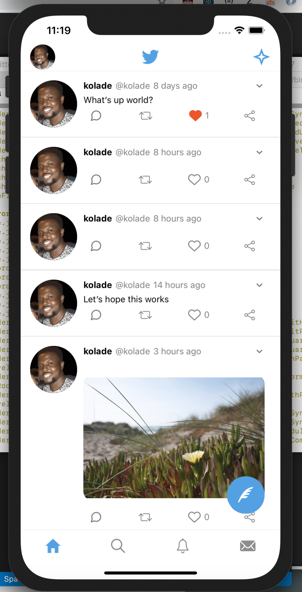

# twitter-app
A dynamic test concept app to represent the twitter app made with react native via Expo and graphql using AWS Amplify. 

# What I Learned

* Fetch & display data using graphql
* How to useTypeScript. 
* How to use AWS Amplify. 
* & much more

# App Image
